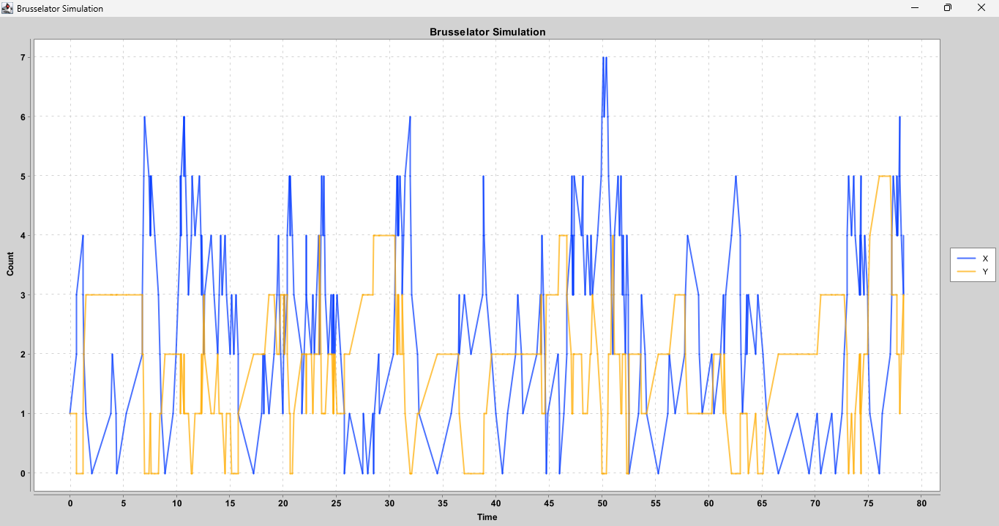

# Lab 06 - Modelling
## Task 1 - Verifier
Code and do some analysis on the Readers & Writers Petri Net. Add a test to check that in no path long at most 100 states mutual
exclusion fails (no more than 1 writer, and no readers and writers together). Can you extract a small API for representing safety properties?
What other properties can be extracted? How the boundness assumption can help?

To complete this task, I developed an implementation of the petri readers and writers network using the DSL already specified.
I then created an enum of all possible Places (Idle, ChooseAction, ReadyToRead, etc.) and their transitions.

I have also implemented methods for testing the safety properties of the petri net:
- **Mutual Exclusion**.
- **Reachability** 
- **Boundedness**.

To test these properties I used the paths method which, given a starting state and a length, finds all possible paths of the specified length. In this way, it was possible to prove that even for very long paths, the properties were not violated.

In accordance with the specifications of the task, I proceeded to extract an API representing the safety properties. Subsequently, I proceeded to remove the safety control functions from the specific PetriNet and to incorporate them into the PetriNet object.

The respective code is available at *src/main/scala/u06/modelling/PetriNet.scala*, and the tests at *src/test/scala/u06/task1/ReadersWritersPetriNetTest.scala*.

## Task 2 - Artist
Create a variation/extension of PetriNet meta-model, with priorities: each transition is given a numerical priority, and no transition can
fire if one with higher priority can fire. Show an example that your pretty new “abstraction” works as expected. Another interesting extension
is “coloring”: tokens have a value attached, and this is read/updated by transitions.

To complete this task, I created an extension of the Petri net, adding priorities and colours.

The respective code is available at *src/main/scala/u06/task2/ExtendedRWPetriNet.scala* and *src/main/scala/u06/modelling/ExtendedPetriNet.scala*.

### Priority 
Priority in a Petri net determines the order in which transitions are activated; each arc is associated with a priority that indicates the relative importance of that arc compared to the others. 
When several transitions are ready to be activated at the same time, the one with the highest priority is executed first.

To implement this extension, I added an integer priority field to the Trn class, to which I assigned a default value of 1.

I subsequently modified the toSystem method so that it would execute transitions with a higher priority. 
To do this, I analysed all possible transitions by finding the highest of these priorities, and then filtered the possible transitions to keep only those with the highest priority.

Finally, I added a new operator to the DSL that would allow the priority to be applied to a transition when the petri net was created.

To test the operation of this new functionality I created a Petri net by assigning a higher priority to the read than to the write and verified, by analysing the paths, that the tokens actually only took the read route.

### Colors 

We want to extend the Petri net model by adding the possibility of having coloured tokens (e.g. black or red) and each transition can only accept tokens of a certain colour and when activated it changes the colour of the token it passes.

To implement this new functionality I created an enum for colours and a new case class representing the pair (place, colour). 
Again, I set a default colour value to make it possible to use the Petri net even without using colours. 

To demonstrate that the behaviour is as desired, I created a Petri net having in the readers' branch all transitions with red incoming and outgoing arcs, and having in the writers' branch all transitions with black incoming and outgoing arcs.
Only the last transition that returns the token to the beginning reverses the colour. 

Thus, by calling paths with only one token in the starting place, it is possible to verify that the token alternates between the two branches, executing the readers' branch once and the writers' branch once.

# Lab 07 - Stochastic Modelling

## Task 1 - Simulator
In this task, I've crafted two functions to conduct analyses on the StochasticChannel.

The respective code can be found here: *src/main/scala/u07/examples/StochasticChannelSimulation.scala*

The primary function is designed to calculate the average time taken for communication across n runs.

```
def averageTimeStochasticChannel(nRun: Int): Double =
  (0 to nRun).foldLeft(0.0)((z, t) =>
    z + stocChannel.newSimulationTrace(IDLE, new Random)
      .take(10)
      .toList
      .find(e => e._2 == DONE)
      .map(_.time)
      .getOrElse(0.0)) / nRun
```
To achieve this, I run a simulation of the communication n times. For each run, we track the moment when the DONE state is reached using the foldLeft operator. Then, we aggregate all these times and calculate the average by dividing the total by the number of runs.

The second function is more intricate. It determines the percentage of time during which the system remains in the FAIL state until it successfully completes the communication.

```
def percentageTimeInFailState(nRun: Int): Double =
  val totalTimes = (0 to nRun).foldLeft((0.0, 0.0)) ((acc, _) => {
    val (failTime, totTime) = stocChannel.newSimulationTrace(IDLE, new Random)
    .take(10)
    .toList
    .sliding(2)
    .foldLeft((0.0, 0.0))((z, s) => if s(0).state == FAIL then (z._1 + s(1).time - s(0).time, s(1).time) else (z._1, s(1).time))
    (acc._1 + failTime, acc._2 + totTime)
  })
  totalTimes._1 / totalTimes._2
```

The function generates n runs. For each run, it accumulates a tuple (failTime, totTime) by considering pairs of Event. If the current event is FAIL, it calculates the fail time by subtracting the next event time from the current one.
Once we have the tuple (failTime, totTime) for a single simulation, we accumulate it using an external foldLeft. 

Finally, we divide the time spent in failure by the total time across all simulations to get the percentage.

In a second step, I extracted an API, as the task required. The relevant code is available in the following file: *src/main/scala/u07/modelling/CTMCSimulation.scala*.

In a second step, I extracted an API, as the task required. The relevant code is available in the following file: *src/main/scala/u07/modelling/CTMCSimulation.scala*.

I then implemented the following functions:
```
    def averageTimeToReachState(nRun: Int, initialState: S, stateToCheck: S): Double =
      (0 to nRun).foldLeft(0.0)((z, _) => z + self.newSimulationTrace(initialState, new Random)
        .take(10)
        .toList
        .find(e => e.state == stateToCheck).map(e => e.time).getOrElse(0.0)) / nRun
```

```
 def relativeTimeInState(nRun: Int, initialState: S, stateToCheck: S): Double =
      relativeTimeInCondition(nRun, initialState, _ == stateToCheck)

    private def relativeTimeInCondition(nRun: Int, initialState: S, f: S => Boolean): Double =
      val totalTimes = (0 to nRun).foldLeft((0.0, 0.0))((acc, _) => {
        val (conditionTime, totTime) = self.newSimulationTrace(initialState, new Random)
          .take(10)
          .toList
          .sliding(2)
          .foldLeft((0.0, 0.0))((z, s) => if (f(s(0).state)) (z._1 + (s(1).time - s(0).time), s(1).time) else (z._1, s(1).time))

        (acc._1 + conditionTime, acc._2 + totTime)
      })
      totalTimes._1 / totalTimes._2
```

## Task 2 - Guru
Check the SPN module, that incorporates the ability of CTMC modelling on top of Petri Nets, leading to Stochastic Petri
Nets. Code and simulate Stochastic Readers & Writers shown in previous lesson. Try to study how key parameters/rate
influence average time the system is in read or write state.

To complete this task, I implemented a stochastic Readers and writers petri net. The relevant code is available at: *src/main/scala/u07/task2/RWStochasticPetriNet.scala*
```
  val stochasticRWPetriNet = SPN[Place](
    Trn(MSet(Idle), m => 1.0, MSet(ChooseAction), MSet()),
    Trn(MSet(ChooseAction), m => 200000, MSet(ReadyToRead), MSet()),
    Trn(MSet(ChooseAction), m => 100000, MSet(ReadyToWrite), MSet()),
    Trn(MSet(ReadyToRead, HasPermission), m => 100000, MSet(Reading, HasPermission), MSet()),
    Trn(MSet(Reading), m => 0.1 * m(Reading), MSet(Idle), MSet()),
    Trn(MSet(ReadyToWrite, HasPermission), m => 100000, MSet(Writing), MSet(Reading)),
    Trn(MSet(Writing), m => 0.2, MSet(Idle, HasPermission), MSet())
  )
```
After implementing the petri net, I used the previously developed API to calculate the percentage of time the petri net spends in a given state (read, write and neither of the previous two states).


## Task 3 - Chemist
SPNs can be used to simulate dynamics of chemical reactions. Experiment with it. E.g.: search the “Brussellator” chemical
reaction on wikipedia: it oscillates! Try to reproduce it.

To complete this task, I implemented a Petri net by modelling chemical reactions as transitions. I then modified the rates of the transitions to obtain the desired oscillations.

In order to simulate chemical reactions, I modified the transitions so that the reactants (A and B) never ended. In particular, every time A is consumed, it is immediately added back. Same with the transitions using B. 

This makes it possible to run simulations of the desired length without worrying about the reactants.

```
enum Place:
    case A, B, D, E, X, Y

val brusselatorPetriNet = SPN[Place](
    Trn(MSet(A), m => 1, MSet(X, A), MSet()),
    Trn(MSet(X, X, Y), m => m(Y), MSet(X, X, X), MSet()),
    Trn(MSet(B, X), m => m(X) * 0.5, MSet(Y, D, B), MSet()),
    Trn(MSet(X), m => m(X) * 0.5, MSet(E), MSet()))
```

The complete code is available in the following file: *src/main/scala/u07/task3/BrusselatorPetriNet.scala*.

I then printed out the oscillations of X and Y obtained from the simulation in a graph, shown below.



# Lab 08 - Stochastic Analysis
## Task 1 - PRISM
- Make the stochastic Readers & Writers Petri Net seen in lesson work: perform experiments to investigate the probability
that something good happens within a bound.
- Play with PRISM configuration to inspect steady-state proabilities of reading and writing (may need to play with options
anche choose “linear equations method”).

To complete this task, I used PRISM to check some properties of the stochastic Readers and Writers petri net.

Below is the model code:

```
ctmc
const int N = 20;
module RW
p1 : [0..N] init N;
p2 : [0..N] init 0;
p3 : [0..N] init 0;
p4 : [0..N] init 0;
p5 : [0..N] init 1;
p6 : [0..N] init 0;
p7 : [0..N] init 0;
[t1] p1>0 & p2<N -> 1 : (p1'=p1-1)&(p2'=p2+1);
[t2] p2>0 & p3<N -> 200000 : (p2'=p2-1) & (p3'=p3+1);
[t3] p2>0 & p4<N -> 100000 : (p2'=p2-1) & (p4'=p4+1);
[t4] p3>0 & p5>0 & p6<N -> 100000 : (p3'=p3-1) & (p6'=p6+1);
[t5] p4>0 & p5>0 & p6=0 & p7<N -> 100000 : (p4'=p4-1) & (p5'=p5-1) & (p7'=p7+1);
[t6] p6>0 & p1<N -> p6*1 : (p6'=p6-1) & (p1'=p1+1);
[t7] p7>0 & p5<N & p1<N -> 0.5 : (p7'=p7-1) & (p1'=p1+1) & (p5'=p5+1);
endmodule
```

Initially, I tried to find the probability that at least one token reaches the read state (p6) within k time steps.

```
P=? [ (true) U<=k (p6>0) ]
```

Result:


Next I tried to find the probability that at least one token reaches the write state within k time steps.

```
P=? [ (true) U<=k (p7>0) ]
```

Result:


Finally I checked that the mutual exclusion property was not violated, thus checking that there were no readers and writers at the same time.

```
P=? [ (true) U<=k (p6>0)&(p7>0) ]
```

Result:


# Lab 09 - Reinforcement Learning
## Task 01 - BASIC-Q-LEARNING
- Get acquainted with the basic tool of Q-learning, focussing on examples/TryQLearningMatrix
- Check how variation of key parameters (epsilon, gamma, alpha, episode length) affects learning
- Check how learning gets more difficult as the grid size increases

The parameters considerated are the following:

- `Gamma:` This parameter influences the significance of future rewards.
- `Alpha:` This regulates the balance between existing knowledge and new information.
- `Epsilon:` This determines the exploration tendency; higher values result in more exploratory behavior.
- `Episodes:` The number of training iterations for the agent.
- `Grid size:` The dimensions of the "map," impacting the learning complexity.

### First configuration

**Parameters:**

- gamma = 0.9

- alpha = 0.5

- epsilon = 0.3

- grid size = 5x5

- episodes: 10000

**Policy learned:**


**V-Table:**


### Second configuration

**Parameters:**

- gamma = 0.8

- alpha = 0.5

- epsilon = 0.3

- grid size = 5x5

- episodes: 10000


**Policy learned:**


**V-Table:**


In this configuration I tried to decrease gamma from 0.9 to 0.8.

Previously, since gamma was very high, the policy tended to reach the jump with the higher reward despite being further away.
In this case, however, even though I have only lowered gamma by 0.1 we notice that the policy also starts to consider the jump with the lowest reward if we are close to it.

By lowering the gamma value even more (gamma = 0.1), the optimal policy does not change, but the values of the V-Table become much lower, as shown in the images below.


### Third configuration

**Parameters:**

- gamma = 0.9

- alpha = 0.5

- epsilon = 0.3

- grid size = 5x5

- episodes: 500


**Policy learned:**


**V-Table:**


In this configuration I have significantly decreased the number of episodes used for the learning phase, we can see that the learned policy is less precise.


### Fourth configuration

With the following configurations I tried to analyse how the policy and v-table changes when the epsilon parameter is changed.
To do this I increased the grid size because I noticed that with the previous grid size the changes were not significant.

**Parameters:**

- gamma = 0.8

- alpha = 0.5

- epsilon = 0.3

- grid size = 8x8


**Policy learned:**


**V-Table:**


In this case, as epsilon has a low value, moving away from the starting position the policy is not optimal because the agent tends not to explore the furthest areas.

### Fifth configuration

**Parameters:**

- gamma = 0.8

- alpha = 0.5

- epsilon = 0.9

- grid size = 8x8


**Policy learned:**


**V-Table:**


In this case, however, I have set the value of epsilon to 0.9. as epsilon has a very high value, the agent will also explore the more distant areas and therefore the policy will also be correct in these areas.
